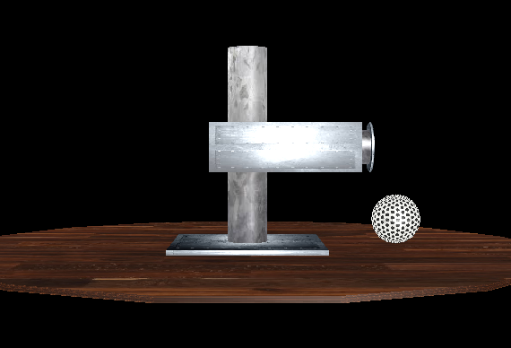
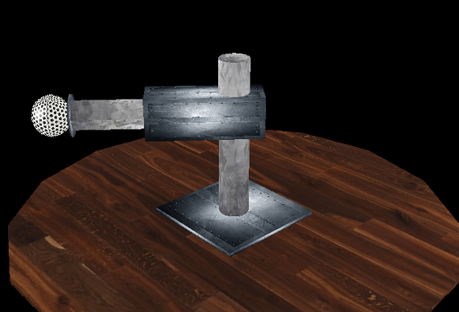
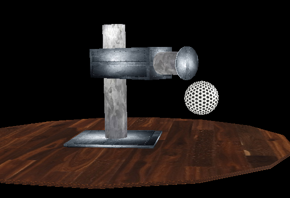

# Cylindical-Arm

It's a student project to prove our JAVA 3D skills.
Project consists of a model of cylindrical arm which we can move in diferent directions 
(up, down, rotation, putting forward and slipping in).
We can also record trajectory of a random movement (also interaction witn a primitive - in this case it's a ball).
We can change the view on the arm by pressing and moving mouse and also move closer or farther by scrolling.
 

- UP Arrow - up
- DOWN Arrow - down
- LEFT Arrow - clockwise rotation
- RIGHT ARROW - counter-clockwise rotation
- Z - slipping in
- X - putting forward
- C - catching primitive
- SPACE - releasing primitive

 
Language: JAVA/JAVA3D

IDE: NetBeans 8.1 with Java3D libraries
   
If u have any questions please contact me on pprzybyt@gmail.com

  
  
   
    

